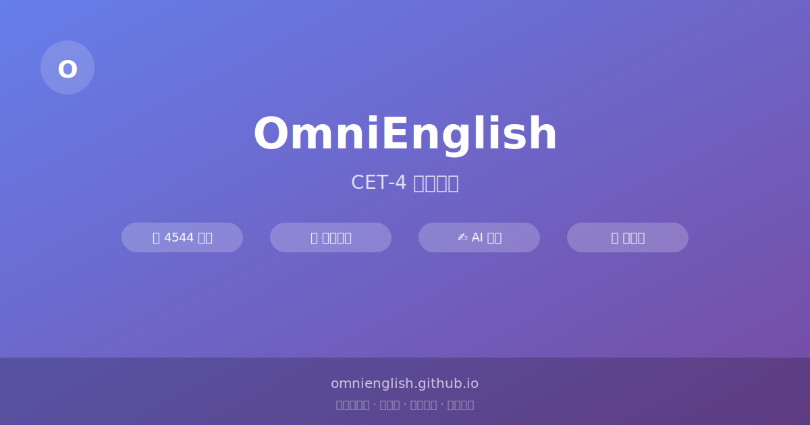

<div align="center">



# OmniEnglish

**CET-4 备考平台 · 专为中国大学生打造**

[](https://omnienglish.github.io)
[](LICENSE)
[](https://omnienglish.github.io)

*一个轻量、无框架、开箱即用的英语学习工具，国内直连无需梯子*

</div>

---

## 功能亮点

### 📖 高频词汇墙
- **4544 个 CET-4 核心词汇**，按 BNC 词频排序
- 间隔重复算法：忘记 → +2 复习，模糊 → +5 复习
- 可爱的单词卡牌，支持自定义背景图片/主题
- 词频标签：高频 / 中频 / 低频一目了然

### 🧠 智能复习
- 根据遗忘曲线自动安排复习
- 卡片式复习 + 选择题模式
- 生词本一键收藏，随时回顾

### ✍️ AI 写作批改
- DeepSeek 驱动，精准评分
- 支持写作和翻译两种模式
- 详细批改建议和范文参考

### 📊 学习热力图
- GitHub 贡献图风格，可视化学习轨迹
- 每日学习统计，连续天数追踪
- 6 个月历史记录

### 🎯 更多功能
- **真题长难句** — 逐句拆解，点击单词即查
- **CS 术语潜伏区** — 计算机专业英语
- **Live2D 看板娘** — 陪伴学习不孤单
- **云端同步** — 多设备数据互通

---

## 技术架构

```
┌─────────────────────────────────────────────┐
│  index.html  (单文件, ~4000 行)              │
│  ├── 内联 CSS (自定义属性主题系统)            │
│  └── 内联 JS (原生, 零依赖)                  │
├─────────────────────────────────────────────┤
│  vocab.json  (4544 词, BNC 词频数据)         │
├─────────────────────────────────────────────┤
│  Cloudflare Worker (cf-worker.js)            │
│  └── 代理 Firebase REST API (国内可直连)     │
└─────────────────────────────────────────────┘
```

| 技术 | 选型理由 |
|------|----------|
| 原生 HTML/CSS/JS | 零依赖，秒开加载 |
| Firebase (via Worker) | 免费额度充足，实时同步 |
| Cloudflare Worker | 国内 CDN 节点，10 万次/天免费 |
| Google Fonts | DM Sans + JetBrains Mono |

---

## 快速开始

### 直接访问
👉 **[omnienglish.github.io](https://omnienglish.github.io)** — 无需注册，打开即用

### 本地开发
```bash
git clone https://github.com/omnienglish/omnienglish.github.io.git
cd omnienglish.github.io
# 用任意 HTTP 服务器打开 index.html
npx http-server -p 8080
```

### 部署到自己的 GitHub Pages
1. Fork 本仓库
2. 仓库设置 → Pages → 选择 `main` 分支
3. 访问 `https://<你的用户名>.github.io`

---

## 项目结构

```
.
├── index.html          # 唯一前端文件 (HTML + CSS + JS)
├── vocab.json          # CET-4 词汇数据 (4544 词)
├── cf-worker.js        # Cloudflare Worker 代理代码
├── CLAUDE.md           # 项目开发文档
├── DESIGN.md           # 设计规范
└── PRODUCT.md          # 产品说明
```

---

## 数据同步架构

```
Store.set(key, val)
  → localStorage          (本地持久化)
  → Cloudflare Worker     (国内中转)
    → Firebase Firestore  (云端存储)
```

- 匿名认证，无需注册
- 数据自动双向同步
- 国内直连，无需代理

---

## 自托管 Cloudflare Worker

如果需要独立的云端同步：

1. 登录 [Cloudflare Dashboard](https://dash.cloudflare.com)
2. 创建 Worker，粘贴 `cf-worker.js` 代码
3. 部署后获取 Worker URL
4. 修改 `index.html` 中的 `WORKER_URL`

---

## 贡献

欢迎提交 Issue 和 PR！

1. Fork 本仓库
2. 创建特性分支 (`git checkout -b feature/amazing-feature`)
3. 提交更改 (`git commit -m 'Add amazing feature'`)
4. 推送到分支 (`git push origin feature/amazing-feature`)
5. 创建 Pull Request

---

## 许可证

MIT License © OmniEnglish

---

<div align="center">

**如果觉得有用，请给个 ⭐ Star 鼓励一下！**

Made with ❤️ for CET-4 warriors

</div>
